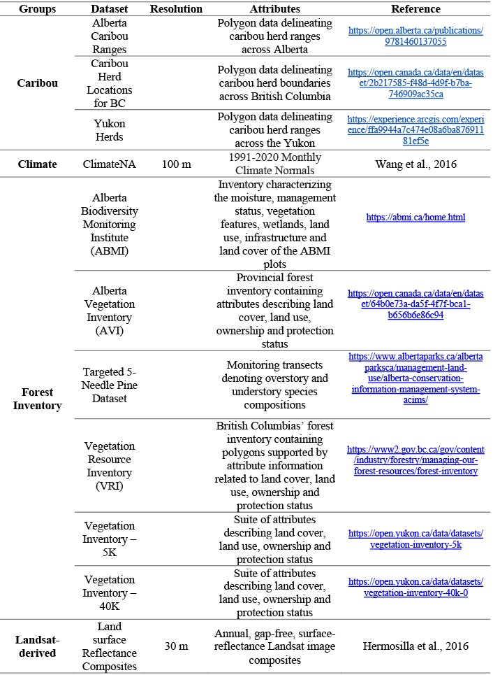

```{r setup,echo=FALSE,message=FALSE,warning=FALSE}
knitr::opts_chunk$set(
  comment =  "#>", 
  collapse = TRUE,
  fig.align = "center")

options(crayon.enabled = TRUE)
old_hooks <- fansi::set_knit_hooks(knitr::knit_hooks, which = c("output", "message", "error"))

rgl::setupKnitr(autoprint = TRUE)
knitr::opts_chunk$set(echo = TRUE)
```

# Data

A summary of the data sources used in this research (Table 1) as well as their derived metrics (Table 3) are listed below, with further details discussed in subsequent sections.

**Table 1: List of datasets and their specifications utilized in this research** 

## Forest Inventory Data

### Alberta

Two Alberta inventory datasets were utilized to obtain tree species distribution information, the Alberta Vegetation Inventory (AVI) and the Alberta Biodiversity Monitoring Institute (ABMI). The AVI is an aerial imagery-based inventory developed to identify the type, extent and condition of forest vegetation in Alberta. Aerial imagery is interpreted in a 3D digital environment to delineate homogeneous forest polygons over crown lands. Polygon attributes are assigned to each polygon via interpretation, ancillary data, and field visits. Attributes include species composition, crown closure class, height, year of origin, structure, condition and productivity class. Tree species composition in a polygon are captured (to a max of 5) in decreasing order of occurrence based on percent crown closure.

The ABMI is a long-term monitoring program that tracks biodiversity in Alberta. ABMI maintains 1656 permanent samples sites spaced evenly across a systematic 20-km grid, at each sample site ground surveys are conducted every five years. These permanent sample sites are supported by the mapping and analysis of 3 km (north to south) by 7 km (east to west) photo-plots surrounding each site. Through interpretation each ABMI photo-plot is delineated into homogeneous polygons, which are supplemented with attribute information. For treed polygons attribute information on management status, stand structure, year of origin, canopy density class, height, species composition and abundance, understory characteristics and disturbances are available.

### British Columbia Forest Inventory

Tree species distribution data for British Columbia was sourced from the current vegetation resource inventory (VRI). The VRI is a photo-based, two step vegetation inventory program that consists of manually delineating homogeneous forest stands via photo interpretation followed by a ground sampling stage. Through interpretation, a range of forest attribute information is available for each delineated polygons this includes species composition (up to six species recorded for each stand), height, canopy closure, age, volume, basal area and stem density.


### Yukon Forest Inventory

The Yukon has two available vegetation inventory data sets. One vegetation inventory dataset is available at a 1:5,000 scale for 'operation level' use has limited coverage over the Haines Junction and south-central regions of the Yukon. The other vegetation inventory is available at a 1:40,000 scale for 'management level' use and has an areal extent that covers a majority of the territory. Both datasets are inventory-based programs centred around aerial photo interpretation to divide the land into homogenous units. To supplement the aerial photo interpretation secondary sources such as ground samples, air/ground calls, regeneration surveys, and permanent sample plot measurements, are included. Within each polygon, detailed forest attributes on species composition, stand height, crown closure and stand age are available.

## Targeted Forest Data Sets 

Limber and Whitebark Pine plot data was sourced from the Alberta Conservation Information Management System (ACIMS). The dataset contains 255 survey transects of varying length across Alberta and British Columbia. Each transect, contain information related to overstory and understory species composition, tree health and disease (specific to limber or whitebark pine), diameter at breast height, and tree regeneration.

## Landsat-derived data

A 2020 annual Landsat best-available-pixel (BAP) composite image [@white2014] and its associated disturbance history, generated following the Composite2Change (C2C) approach[@hermosilla2016] were used to conduct tree species classification. The C2C approach produces annual, gap-free, surface-reflectance image composites with a 30-m spatial resolution as well as the detection and characterization of forest disturbance information from 1985 to present [@hermosilla2015b]. In summary, the C2C approach uses scoring functions as defined in @white2014, to rank and select optimum pixel observations from all available atmospherically-corrected Landsat images [@masek2006; @schmidt2013] to produce composites. These initial composites are then further refined by removing anomalous spectral values through a spike detection algorithm [@kennedy2010] and data gaps are infilled with proxy values using a spectral trend analysis[@hermosilla2015a]. Temporal trends and changes across BAP composites are identified using a bottom-up breakpoint selection algorithm [@keogh2001] over Normalized Burn Ratio (NBR) values [@key2006]. Through the temporal analysis, detected changes are attributed to a change type based on their spectral, temporal, and geometrical characteristics using a Random Forests classifier [@hermosilla2016].

Canopy cover data for the year 2020 was sourced at a 30 m resolution from the National Terrestrial Ecosystem Monitoring System (NTEMS) dataset. Matasci et al. (2018b) generated annual Landsat-derived forest structural layers from 1985 to present across the forested ecosystems of Canada [@matasci2018a; @matasci2018b]. Their approach utilized data from seven airborne laser scanning (ALS) collection campaigns to derive ALS metrics of height and canopy cover, as well as area-based inventory estimates such as biomass. A random forest k-NN imputation method [@crookston2008] was applied to extrapolate these ALS and area-based metrics across Canada, at a 30-m resolution.

## Climate Data

Climate data was accessed and downloaded from the ClimateNA software [@wang2016]. The data downloaded was used to generate spatial climate layers with monthly precipitation and temperature (i.e., minimum and maximum) normals, for the period 1991-2020, at a 100-m spatial resolution. The monthly climate layers produced, were further processed to compute annual average minimum and maximum temperature, and total precipitation values for each pixel.

## Phenology Data

Phenology data was sourced from the Multi-Source Land Surface Phenology (MS-LSP) algorithm [@bolton2020]. The MS-LSP has a temporal extent of 2016-2019 and provides land surface phenology data at a spatial resolution of 30-m over North America. The MS-LSP utilizes time series of vegetation indices to characterize the timing and magnitude of phenophase transitions and seasonality. From the product, a complete set of phenophase metrics were derived. The product year of 2019 was selected, as it most closely corresponds with the year of the Landsat composite utilized. Data gaps in the 2019 MS-LSP product, were filled by prior product year data and through infilling.

## Topographic Data

Topographic metrics were derived from the Advanced Spaceborne Thermal Emission and Reflection Radiometer (ASTER) global digital elevation model (GDEM) version 3 (v3) [@gesch2016]. The first version of the ASTER GDEM released in 2009 was generated using stereo-pair images collected by the ASTER instrument onboard the Terra satellite [@fujisada2011]. Released in 2019, the ASTER GDEM v3 was produced using additional stereo-pair images and an updated production algorithm. In comparison to its predecessors the ASTER GDEM v3 has an improved \~30-m spatial resolution, and horizontal and vertical accuracies, expanded coverage and less artifacts.

## Caribou Data

Caribou home range data was sourced from open-access provincial and territorial datasets for Alberta, British Columbia and the Yukon. Caribou herd information was collected from radio collared caribou to establish population and recruitment estimates, regular caribou population survey and movement monitoring.
