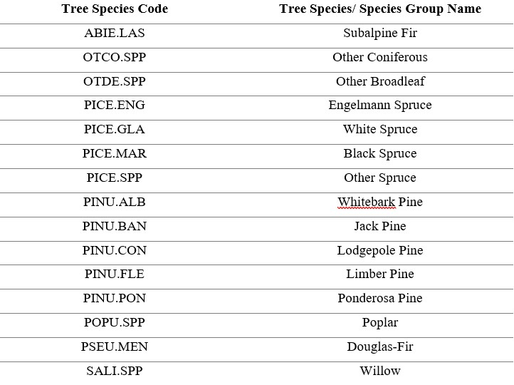
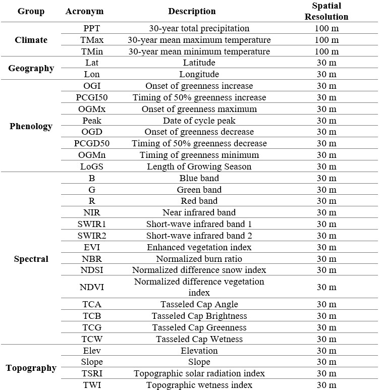
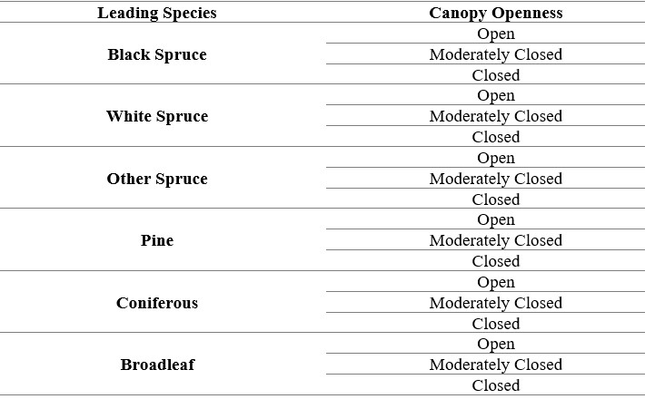

```{r,echo=FALSE,message=FALSE,warning=FALSE}

r3dDefaults = rgl::r3dDefaults
m = structure(c(0.921, -0.146, 0.362, 0, 0.386, 0.482, -0.787, 0, 
-0.06, 0.864, 0.5, 0, 0, 0, 0, 1), .Dim = c(4L, 4L))
r3dDefaults$FOV = 50
r3dDefaults$userMatrix = m
r3dDefaults$zoom = 0.75

knitr::opts_chunk$set(
  comment =  "#>", 
  collapse = TRUE,
  fig.align = "center")

rgl::setupKnitr(autoprint = TRUE)

```

# Methods

## Tile System

A tiling system composed of tiles measuring 150 x 150-km was utilized to partition the provinces and territories of Alberta, British Columbia and the Yukon [@hermosilla2016; @hermosilla2022]. In total 104 number of tiles were partitioned over our area of interest.

## Sample Filtering and Selection

The framework for tree species modelling followed the methodology outlined in @hermosilla2022. To achieve a sample pool in which to draw samples for training and calibration, the raw provincial and territorial forest inventory datasets were filtered by following selection rules when applicable: (i) only polygons covered predominately by treed classes were kept, (ii) polygon area had to be equal to or less than 50 ha to ensure internal homogeneity of features, and (iii) the leading tree species in a polygon had a dominance of greater than or equal to 50%, in order to allow for tree species to be linked to a given spectral signature. The centroid of each of the filtered polygons were extracted to create a training sample pool to derive training and calibration data. To mitigate the large class imbalance between the frequency of dominant and rare species, particularly Limber pine and Whitebark pine, the targeted five-needle pine dataset was added to the training sample pool to supplement the number of these rare classes.

To normalize the tree species codes across the forest inventory datasets, species codes were converted to the species codes utilized in Canada's National Forest Inventory (NFI). Samples assigned to general, indeterminate and variant species codes were removed from the sample pool to limit confusion. For example, when a tree species cannot be accurately classified, they are assigned to a determinate (i.e., PICE.SPP for an unknown spruce tree) or indeterminate genus code (i.e., GENC.SPP for unidentified softwood) followed by the suffix SPP. Additionally, samples affected by stand-replacing disturbances as denoted through an intersection analysis with the 2020 C2C disturbance layer were also removed from the sample pool.

To map alongside key tree species of interest, six other tree species and species groups were included in the modelling design (Table 2). These classes include Douglas-Fir, Other Broadleaf, Other Conifer, Other Spruce, Poplar, Subalpine Fir. The 'Other Broadleaf' class was created by grouping samples belonging to species of Alder, Arbutus, Birch and Maple, together. The 'Other Conifer' class was created by grouping samples belonging to species of Cedar, Cypress, Fir, Hemlock, Juniper and Larch, together. Lastly, the classes other spruce and poplars (Balsam Poplar, Trembling Aspen) were created.

**Table 2: List of mapped tree species/ species groups codes and names** 

The sample selection strategy followed three principles: proportionality, purity and a minimum sampling distance. The number of samples taken from each tree species class is determined by the number of species and their proportion in a given tile [@zhu2016]. For samples extracted for a given species class, samples that are purer, percent dominance of species tending towards 100%, are preferentially selected. A minimum sampling distance of 100 m was used in order to reduce the affects of spatial autocorrelation. An exception to this sample selection strategy was made for the rare species classes of limber pine and willow, wherein all available samples from these classes were sampled to ensure that these classes had sufficient representation for training and validation. In addition, the training samples for the rare species classes of limber pine, whitebark pine and willow were duplicated, a common occurrence when dealing with class imbalances [@fernández2018].

## Predictor Variables

Metrics that characterize climate, geography, phenology, topography and spectral information, were used as predictor variables in the random forest classification models. Climate metrics include average minimum and maximum temperatures, and the total annual precipitation from 1991-2020. Geographic coordinates were derived from the centroid of each Landsat pixel [@shang2020]. Phenophase timing metrics were derived from the MS-LSP product [@bolton2020] which includes Onset of greenness increase, Timing of 50% greenness increase, Onset of greenness maximum, Date of cycle peak, Onset of greenness decrease, Timing of 50% greenness decrease and Timing of greenness minimum. Length of growing season was derived by subtracting the Timing of 50% greenness decrease by the Timing of 50% greenness increase. The topographic metrics of elevation, slope, topographic solar radiation index (TSRI; [@roberts1989]), and topographic wetness index (TWI; [@beven1979]) were derived from the GDEM v3 [@abrams2020]. Lastly, from the 2020 Landsat image composite, surface reflectance values associated with each of the six spectral bands, and a suite of spectral and vegetation indices were derived. The indices derived include the Enhanced Vegetation Index (EVI; [@huete2002]), Normalized Burn Ratio (NBR; [@key2006]), Normalized Difference Vegetation Index (NDVI; [@tucker1979]), Tasseled Cap Angle (TCA; [@powell2010]), Tasseled Cap Brightness (TCB; [@crist1985]), Tasseled Cap Greenness (TCG; [@crist1985]) and Tasseled Cap Wetness (TCW; [@crist1985]).

**Table 3: Predictor variables used in the random forest models** 

## Local Random Forest Models

Tree species classification models were produced for each tile using local training samples and the Random Forests classifier [@breiman2001]. Random Forests is a commonly applied machine learning algorithm in modelling tree species distribution and classification [@hemmerling2021; @hermosilla2022; @immitzer2012; @shang2020] as a result of its powerful predictive performance [@elith2008]. Random Forests is an ensemble decision tree classifier that uses randomly selected subsets of training data and predictor variables for each tree [@breiman2001]. The output class for a pixel during classification, is obtained by majority vote from the outputs of a large number of individual decision trees [@breiman2001]. To supplement the Random Forests prediction, the algorithm produces an internal unbiased estimate of the generalization error, or the out-of-bag (OOB) error, and a measure of input feature importance, the Mean Decrease in Accuracy (MDA) [@han2016]. To parametrize each Random Forests model in the study, the default values where selected wherein the parameter *mtry* was set to the square root of the total number of predictors (31), and the *ntree* parameter to 500. The number of tiles to produce random forest models was reduced from 104 to 89 tiles. Only tiles, with greater than or equal to 10% of its samples belonging to either a spruce or pine species -- as these are considered important species for the Mountain Pine Beetle and key caribou habitat.

To ensure the continuity of individual tree species distributions across tiles, inverse distance weighted neighbourhood sampling over a 3 x 3 kernel was executed. Sampling over the 3 x 3 kernel, resulted in the random forest model for a central tile of interest to be constructed using its own samples (as selected in section 3.2) supplemented by samples from its surrounding neighbours. After this weighted approach, the models had 70% of its training samples belonging to the central tile of interest, and 30% from the rim of the 3 x 3 kernel. In instances, where tiles had no availability of training samples -- these tiles were provided with 1/N (N being number of adjacent tiles) of the samples from their N adjacent tile neighbors.

## Accuracy Assessment

From samples selected in section 3.2, the samples per tile were split 70-30 for training and validation, respectively. In total 64,103 validation points were available.To evaluate the classification accuracy for the tree species map, a confusion matrix was produced using the validation points as reference information. From this confusion matrix overall accuracy, user's and producer's accuracy were derived. Regional and tile specific confusion matrices were created.

## Species at Risk Habitat Analysis

The NTEMS canopy cover layer, which ranges in value from 0% (indicating no canopy) to 100% (indicating completely covered canopy) was reclassified to reflect canopy openness, an important factor in caribou habitat selection [@cichowski2022; @rapai2017; @rudolph2019]**.** The relationship between canopy cover and canopy openness as defined in the "The Canadian National Vegetation Classification: Principles, Methods and Status" report from 2019 [@baldwin2019] follows that a canopy is considered sparse when canopy cover is less than 25%, open between 25-40% cover , moderately closed at 41-60% cover, and closed at canopy cover greater than 60%. Additionally, the leading tree species map was reclassified into the following 6 leading species/ species groups: Black Spruce, White Spruce, Other Spruce, Pine, Coniferous and Broadleaf.

Following this reclassification, the canopy openness and leading tree species layer were combined to form a map with 18 classes (Table 4). The combined map of canopy openness and leading species produced was intersected with caribou herd range data in order to understand the current conditions of key caribou habitat. When differing data delineating the same caribou herd ranges were duplicated across provincial and/or territorial datasets, the range with the most recent observation date was kept while the other was omitted.

**Table 4: List of 18 combined leading species and canopy openness classes created for caribou analysis**


