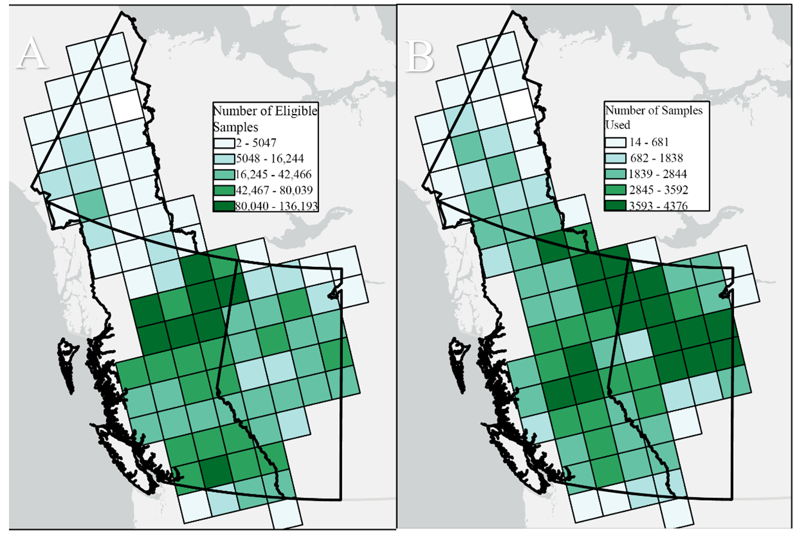
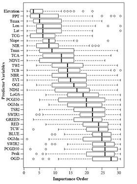
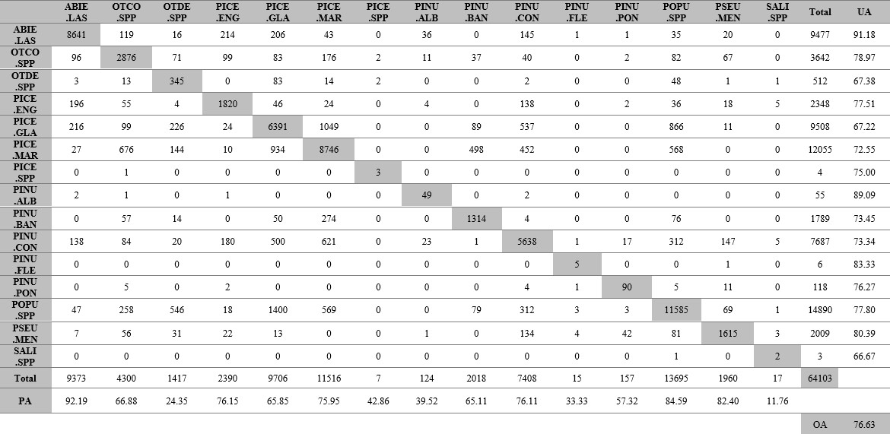
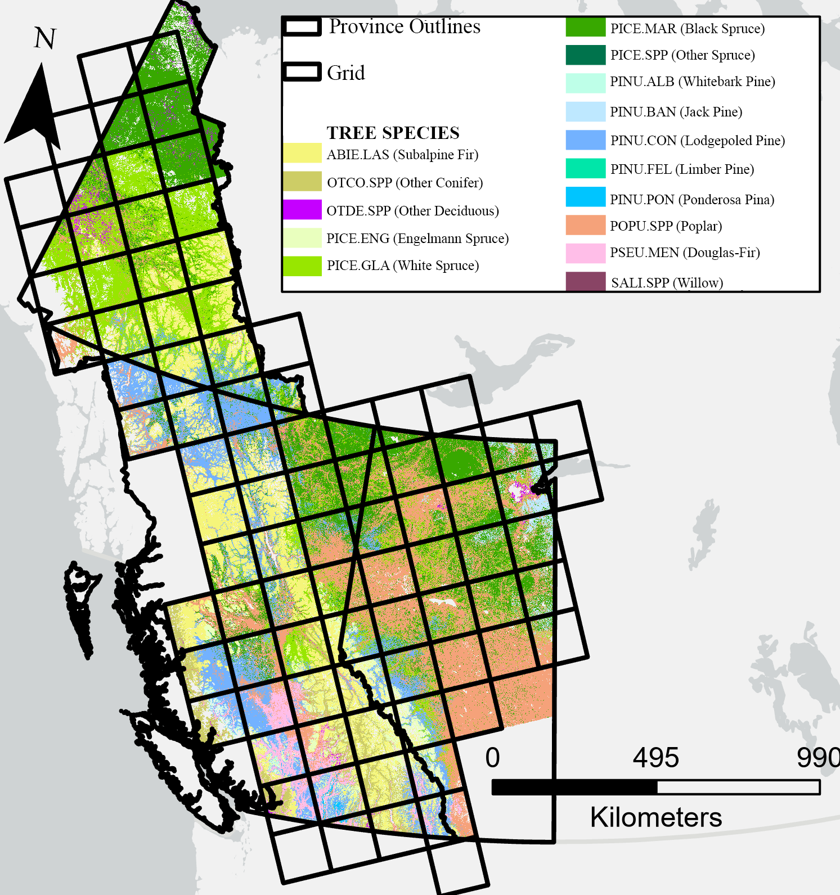
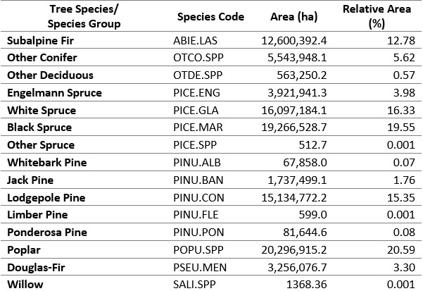
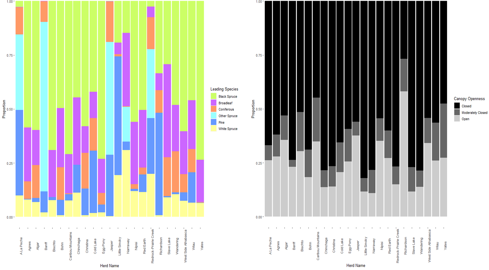
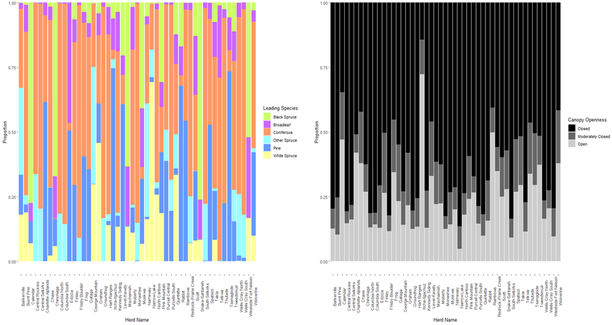
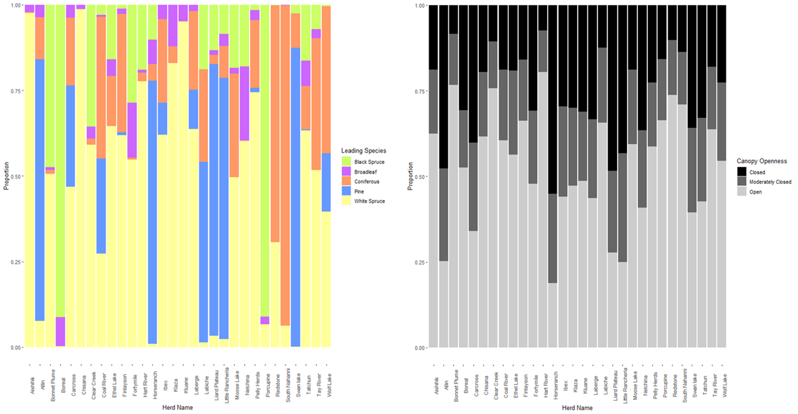
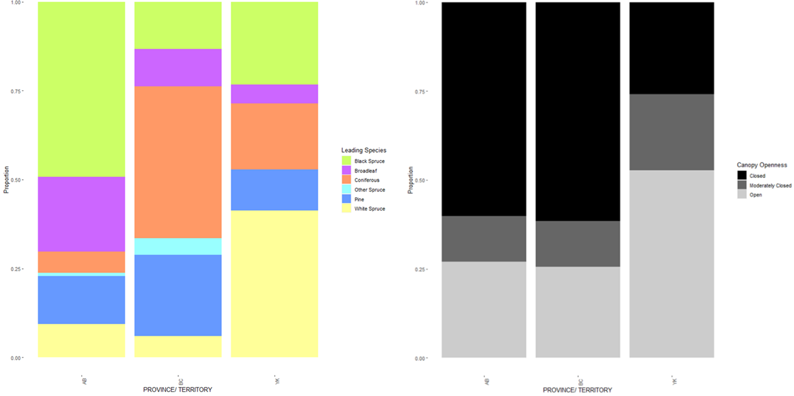

```{r,echo=FALSE,message=FALSE,warning=FALSE}
library(rgl)

r3dDefaults = rgl::r3dDefaults
m = structure(c(0.921, -0.146, 0.362, 0, 0.386, 0.482, -0.787, 0, 
-0.06, 0.864, 0.5, 0, 0, 0, 0, 1), .Dim = c(4L, 4L))
r3dDefaults$FOV = 50
r3dDefaults$userMatrix = m
r3dDefaults$zoom = 0.75

knitr::opts_chunk$set(
  comment =  "#>", 
  collapse = TRUE,
  fig.align = "center")

rgl::setupKnitr(autoprint = TRUE)

```

# Results

## Sample Filtering and selection

The total number of available samples to select for training and calibration from the forest inventory and five needle pine datasets was 5,750,702. Through sample filtering, as described in Section 3.2, the available pool of samples was reduced to 3,158,558. This sample reduction resulted in the number of samples available for each tile to range from 2 to 136,193 (Figure 1A). The number of samples per tile used to generate local random forest models, see section 3.4, ranged from 14 to 4,376 (Figure 1B).



**Figure 1: Illustrates the number of eligible samples per tile (A), and number of samples used to generate a classification model per tile (B)**

## Relative Importance of predictor variables

The overall relative variable importance ranking results (Figure 2) displays the predictor variables sorted by their median ranking for the 89 tiles. The most important set of variables include those that provide climatic, geographic and topographic information as well as some remote sensing variables. These variables include, elevation, total precipitation, annual average maximum temperature, latitude, longitude, tasseled cap greenness index, the NIR band, slope and annual average minimum temperature. This set of variables have a median rank of below 10. The set of variables associated with average median ranks predominately consists of Landsat based vegetation and spectral indices that are commonly used in vegetation assessment and change detection (NDVI, NBR, EVI) as well as some topographic and phenological timing metrics (OGI, LoGS). The last set of predictor variables, with the lowest overall median rankings, were the remaining Landsat bands and phenological timing metrics.

{.center}

**Figure 2: Relative predictor variable importance ranking sorted by median across all tiles. Refer to Table 3 for full names of the predictor variables**

## Accuracy Assessment: Confusion Matrix

The accuracy of the leading tree species classification was assessed using the validation samples from section 3.6 to generate a confusion matrix (Table 5), the overall accuracy was 76.6%. Tree species' producer's accuracy values ranged from 11.8% to 92.2%, with an average value of 59.6%. Tree species' user's accuracy values ranged between 66.7% and 91.2%, with an average value of 76.7%. The tree species classes with the lowest producer accuracy values, and hence experienced the most confusion, include whitebark pine (PINU.ALB), limber pine (PINU.FLE), other deciduous (OTDE.SPP), and willow (SALI.SPP).

**Table 5: Confusion matrix for tree species classification map, includes overall accuracy (OA) and per-class user (UA) and producers' accuracies (PA) values**



## Leading Tree Species Map

The leading tree species map for our region of interest across the provinces and territories of Alberta, British Columbia, and the Yukon, at a 30-m resolution is shown below, in Figure 3. In total 15 tree species and species groups were mapped. Supporting the classified map, Table 6, displays a summary table indicating the absolute and relative areas of each mapped class. The most common species class mapped is Poplar which has an extent of over 20 Mha, representing roughly 20.6% of the total area mapped. The least common tree species mapped is the class Other Spruce, with an extent of 512 ha, representing only 0.001% of the area mapped.



**Figure 3: Classification map for leading tree species across our AOI at a 30-m resolution for the year 2020**

**Table 6: Summary table of tree species or species groups mapped and their associated absolute and relative areas**



## Caribou Habitat Analysis

From the overlay analysis of caribou herd ranges with the combined tree species and canopy cover map, the forested area for each caribou herd could be summarized by proportional area covered by leading overstory tree species and canopy openness. These summarized results for each herd can be seen below for the caribou herds residing in Alberta (Figure 4), British Columbia (Figure 5) and the Yukon (Figure 6). Comparing caribou herd habitat by province and territory, the dominant leading tree species for Alberta is Black Spruce (accounting for 48.7% of area), Coniferous for British Columbia (39.1%), and White Spruce for the Yukon (37.5%), see Figure 7. With respect to forest structure and canopy openness, the forested habitat for Alberta and British Columbia was predominately closed canopy, which accounted for 60.2% and 61% of area respectably, whereas the forested habitat in the Yukon typically displayed an open canopy (52.1%).



**Figure 4: Summary of the forested area in the 24 caribou herd ranges in Alberta. The forested area for each caribou herd is summarized by proportion of (A) leading overstory tree species and (B) canopy openness**



**Figure 5: Summary of the forested area in the 55 caribou herd ranges in British Columbia. The forested area for each caribou herd is summarized by proportion of (A) leading overstory tree species and (B) canopy openness**



**Figure 6: Summary of the forested area in the 30 caribou herd ranges in the Yukon. The forested area for each caribou herd is summarized by proportion of (A) leading overstory tree species and (B) canopy openness**



**Figure 7: Comparison of caribou herd habitat across different provinces and territories by (A) leading overstory tree species and (B) canopy openness**
