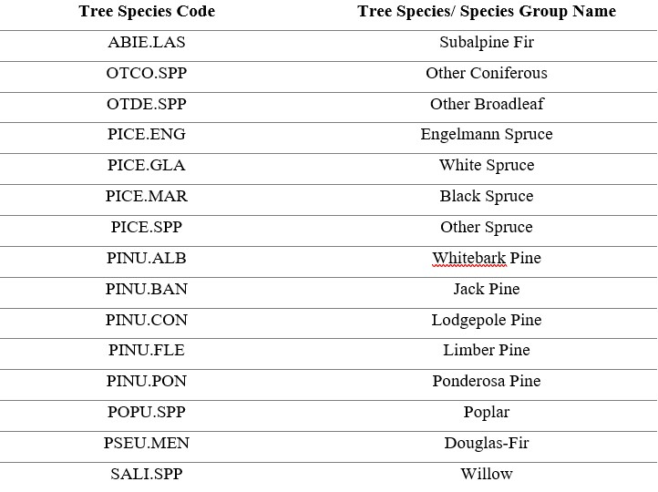
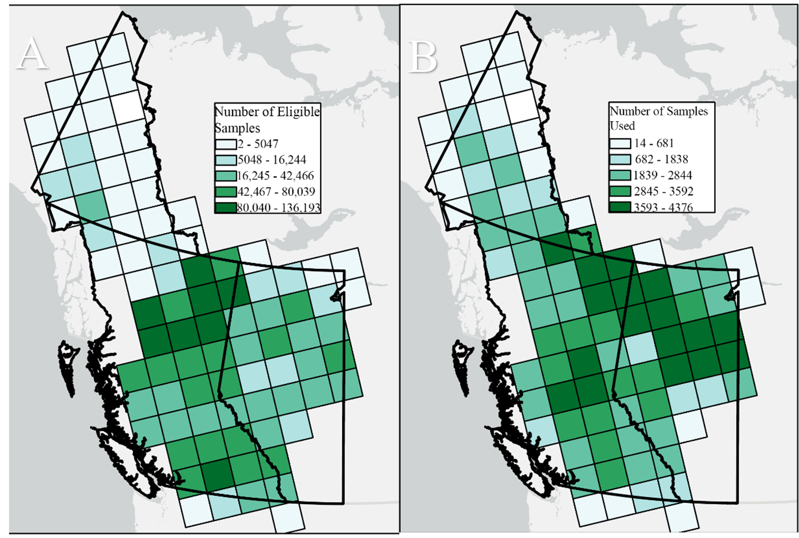
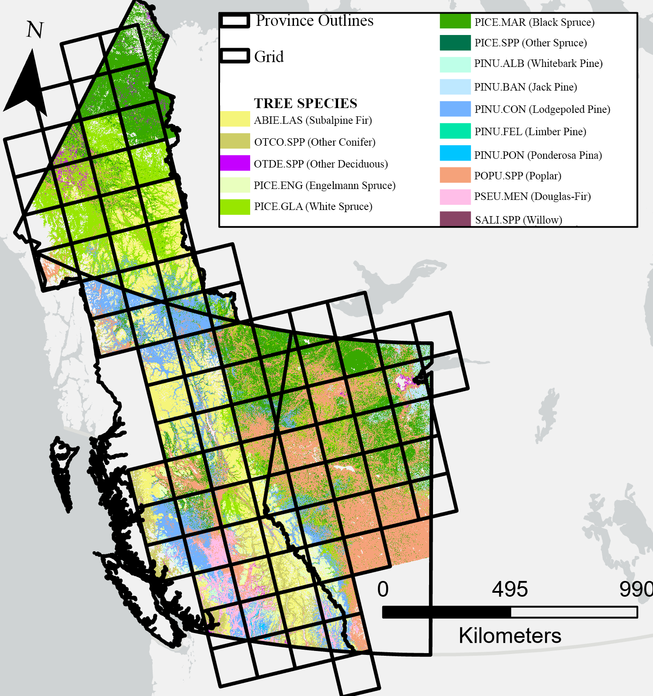

# Introduction {#sec-introduction}

The mountain pine beetle (MPB), Dendroctonus ponderosae, is a native wood-boring insect to pine forests in Western North America. The MPB attacks a wide range of pine trees and their population periodically erupts causing large-scale outbreaks. In the late 1990s, the most recent outbreak of MPB in British Columbia began and resulted in the death of more than 18 million ha of pine forests by the year 2011 [@bleiker2019]. The scale and level of tree mortality associated with this outbreak was attributed to the continuous geographic and host range expansion of the mountain pine beetle into previously undisturbed forests [@bleiker2019; @cooke2017; @hicke2006]. In addition to this outbreak, concern for the potential MPB range expansion into the boreal and eastern pine forests grew, as the MPB had spread from its preferred lodgepole pine (Pinus Contorta) host and began successfully attacking and reproducing in jack pine (Pinus Banksiana), a transcontinental pine species [@cooke2017; @cullingham2011]. To control MPB populations and slow the spread of infestation, various mitigation and management strategies are required, this includes sanitation harvesting to remove infested trees, salving logging (clear cut) operations, prescribed burns, and the use of attractants, repellants and insecticides [@coops2008; @fettig2014; @gillette2014; @lindenmayer2012; @six2014].

MPB outbreaks have significant impacts on forest structure and ecosystem services (i.e., timber supply, water supply, scenic beauty, carbon storage) [@dhar2016]. MBP infestation alters overstory forest cover, decreasing canopy cover and creating canopy gaps, which has cascading effects on the understory vegetation, resulting in increased light penetration and reduced snow interception [@chan-mcleod2006; @fornwalt2018; @saab2014]. These ecological changes in pine forests, following MPB outbreaks have important implications and effects on wildlife populations and their habitats [@saab2014]. In particular MPB outbreaks affect Woodland caribou (Rangifer tarandus), which are a designated species-at-risk in Canada [@canada2012] that require large tracts of low-productivity coniferous forests characterized by low densities of other ungulates and wolves in order to sustain healthy populations [@festa-bianchet2011]. The preferred woodland caribou habitat is characterized by mature, open canopy coniferous stands - the selection for these stands is in part related to the stands structure allowing for the facilitation and growth of arboreal and terrestrial lichen mats which are important food sources for caribou to forage during winter months [@cichowski2022; @festa-bianchet2011; @rapai2017; @rudolph2019; @russell2019].

Remote sensing technology is a useful tool that allows for the acquisition of information about the earths surface. Remotely sensed data is available at a variety of spatial and temporal resolutions [@lechner2020]. Research in the field of remote sensing has benefited from the trend of large, data-analysis ready, remotely sensed datasets to be free and open-access for research [@lechner2020]. A notable example being the complete archive from the Landsat series of satellites dating back to 1972, which provides over 50 years of Earth observation data [@white2014a]. Remote sensing has become an essential tool in the fields of forest ecology and management [@kwok2018; @lechner2020]. Applications for remote sensing in forest ecology include updating forest inventories [@shang2020], measuring forest structure [@lim2003] and characterizing forest habitat structure [@guo2017], mapping the presence and distribution of tree species [@fassnacht2016; @hermosilla2022; @thompson2015], monitoring forest health [@lausch2016] and in the detection, mapping and monitoring of insect outbreaks [@wulder2006] among others.

The ecological changes to pine forests following MPB outbreaks impacts the range and abundance of this key woodland caribou habitat. To understand the future risks posed by the MPB to caribou in Canada, and to inform future species-at-risk management strategies, it is imperative to understand the current conditions of key caribou habitat. The primary objective of this research is to develop high spatial resolution, tree species prediction, for key overstory tree species found in MPB-impacted ecosystems across the entire caribou range in western Canada (in Alberta, British Columbia and the Yukon). Key overstory tree species are individual species of pine, spruce and deciduous. The resultant species layers produced will provide fine scale species information for managers and researchers to facilitate trade-offs between species-at-risk management, MPB mitigation efforts and timber extraction.


------------------------------------------------------------------------


<!--chapter:end:index.Rmd-->

---
bibliography: references.yaml
---

```{r setup,echo=FALSE,message=FALSE,warning=FALSE}
knitr::opts_chunk$set(
  comment =  "#>", 
  collapse = TRUE,
  fig.align = "center")

options(crayon.enabled = TRUE)
old_hooks <- fansi::set_knit_hooks(knitr::knit_hooks, which = c("output", "message", "error"))

rgl::setupKnitr(autoprint = TRUE)
knitr::opts_chunk$set(echo = TRUE)
```

# 2. Data {#sec-data}

A summary of the data sources used in this research (Table 1) as well as their derived metrics (Table 3) are listed below, with further details discussed in subsequent sections.

**Table 1: List of datasets and their specifications utilized in this research** 

## 2.1 Forest Inventory Data {#sec-forest-inventory-data}

### 2.1.1 Alberta {#sec-alberta-forest-inventory-datasets}

Two Alberta inventory datasets were utilized to obtain tree species distribution information, the Alberta Vegetation Inventory (AVI) and the Alberta Biodiversity Monitoring Institute (ABMI). The AVI is an aerial imagery-based inventory developed to identify the type, extent and condition of forest vegetation in Alberta. Aerial imagery is interpreted in a 3D digital environment to delineate homogeneous forest polygons over crown lands. Polygon attributes are assigned to each polygon via interpretation, ancillary data, and field visits. Attributes include species composition, crown closure class, height, year of origin, structure, condition and productivity class. Tree species composition in a polygon are captured (to a max of 5) in decreasing order of occurrence based on percent crown closure.

The ABMI is a long-term monitoring program that tracks biodiversity in Alberta. ABMI maintains 1656 permanent samples sites spaced evenly across a systematic 20-km grid, at each sample site ground surveys are conducted every five years. These permanent sample sites are supported by the mapping and analysis of 3 km (north to south) by 7 km (east to west) photo-plots surrounding each site. Through interpretation each ABMI photo-plot is delineated into homogeneous polygons, which are supplemented with attribute information. For treed polygons attribute information on management status, stand structure, year of origin, canopy density class, height, species composition and abundance, understory characteristics and disturbances are available.

### 2.1.2 British Columbia Forest Inventory {#sec-bc-forest-inventory-datasets}

Tree species distribution data for British Columbia was sourced from the current vegetation resource inventory (VRI). The VRI is a photo-based, two step vegetation inventory program that consists of manually delineating homogeneous forest stands via photo interpretation followed by a ground sampling stage. Through interpretation, a range of forest attribute information is available for each delineated polygons this includes species composition (up to six species recorded for each stand), height, canopy closure, age, volume, basal area and stem density.

### 2.1.3 Yukon Forest Inventory {#sec-yukon-forest-inventory-datasets}

The Yukon has two available vegetation inventory data sets. One vegetation inventory dataset is available at a 1:5,000 scale for 'operation level' use has limited coverage over the Haines Junction and south-central regions of the Yukon. The other vegetation inventory is available at a 1:40,000 scale for 'management level' use and has an areal extent that covers a majority of the territory. Both datasets are inventory-based programs centred around aerial photo interpretation to divide the land into homogenous units. To supplement the aerial photo interpretation secondary sources such as ground samples, air/ground calls, regeneration surveys, and permanent sample plot measurements, are included. Within each polygon, detailed forest attributes on species composition, stand height, crown closure and stand age are available.

## 2.2 Targeted Forest Data Sets {#sec-targeted-forest-dataset}

Limber and Whitebark Pine plot data was sourced from the Alberta Conservation Information Management System (ACIMS). The dataset contains 255 survey transects of varying length across Alberta and British Columbia. Each transect, contain information related to overstory and understory species composition, tree health and disease (specific to limber or whitebark pine), diameter at breast height, and tree regeneration.

## 2.3 Landsat-derived data {#sec-landsat-derived-data}

A 2020 annual Landsat best-available-pixel (BAP) composite image [@white2014] and its associated disturbance history, generated following the Composite2Change (C2C) approach[@hermosilla2016] were used to conduct tree species classification. The C2C approach produces annual, gap-free, surface-reflectance image composites with a 30-m spatial resolution as well as the detection and characterization of forest disturbance information from 1985 to present [@hermosilla2015b]. In summary, the C2C approach uses scoring functions as defined in @white2014, to rank and select optimum pixel observations from all available atmospherically-corrected Landsat images [@masek2006; @schmidt2013] to produce composites. These initial composites are then further refined by removing anomalous spectral values through a spike detection algorithm [@kennedy2010] and data gaps are infilled with proxy values using a spectral trend analysis[@hermosilla2015a]. Temporal trends and changes across BAP composites are identified using a bottom-up breakpoint selection algorithm [@keogh2001] over Normalized Burn Ratio (NBR) values [@key2006]. Through the temporal analysis, detected changes are attributed to a change type based on their spectral, temporal, and geometrical characteristics using a Random Forests classifier [@hermosilla2016].

Canopy cover data for the year 2020 was sourced at a 30 m resolution from the National Terrestrial Ecosystem Monitoring System (NTEMS) dataset. Matasci et al. (2018b) generated annual Landsat-derived forest structural layers from 1985 to present across the forested ecosystems of Canada [@matasci2018a; @matasci2018b]. Their approach utilized data from seven airborne laser scanning (ALS) collection campaigns to derive ALS metrics of height and canopy cover, as well as area-based inventory estimates such as biomass. A random forest k-NN imputation method [@crookston2008] was applied to extrapolate these ALS and area-based metrics across Canada, at a 30-m resolution.

## 2.4 Climate Data {#sec-climate-data}

Climate data was accessed and downloaded from the ClimateNA software [@wang2016]. The data downloaded was used to generate spatial climate layers with monthly precipitation and temperature (i.e., minimum and maximum) normals, for the period 1991-2020, at a 100-m spatial resolution. The monthly climate layers produced, were further processed to compute annual average minimum and maximum temperature, and total precipitation values for each pixel.

## 2.5 Phenology Data {#sec-phenology-data}

Phenology data was sourced from the Multi-Source Land Surface Phenology (MS-LSP) algorithm [@bolton2020]. The MS-LSP has a temporal extent of 2016-2019 and provides land surface phenology data at a spatial resolution of 30-m over North America. The MS-LSP utilizes time series of vegetation indices to characterize the timing and magnitude of phenophase transitions and seasonality. From the product, a complete set of phenophase metrics were derived. The product year of 2019 was selected, as it most closely corresponds with the year of the Landsat composite utilized. Data gaps in the 2019 MS-LSP product, were filled by prior product year data and through infilling.

## 2.6 Topographic Data {#sec-topographic-data}

Topographic metrics were derived from the Advanced Spaceborne Thermal Emission and Reflection Radiometer (ASTER) global digital elevation model (GDEM) version 3 (v3) [@gesch2016]. The first version of the ASTER GDEM released in 2009 was generated using stereo-pair images collected by the ASTER instrument onboard the Terra satellite [@fujisada2011]. Released in 2019, the ASTER GDEM v3 was produced using additional stereo-pair images and an updated production algorithm. In comparison to its predecessors the ASTER GDEM v3 has an improved \~30-m spatial resolution, and horizontal and vertical accuracies, expanded coverage and less artifacts.

## 2.7 Caribou Data {#sec-caribou-data}

Caribou home range data was sourced from open-access provincial and territorial datasets for Alberta, British Columbia and the Yukon. Caribou herd information was collected from radio collared caribou to establish population and recruitment estimates, regular caribou population survey and movement monitoring.

<!--chapter:end:02-Data.Rmd-->

```{r,echo=FALSE,message=FALSE,warning=FALSE}

r3dDefaults = rgl::r3dDefaults
m = structure(c(0.921, -0.146, 0.362, 0, 0.386, 0.482, -0.787, 0, 
-0.06, 0.864, 0.5, 0, 0, 0, 0, 1), .Dim = c(4L, 4L))
r3dDefaults$FOV = 50
r3dDefaults$userMatrix = m
r3dDefaults$zoom = 0.75

knitr::opts_chunk$set(
  comment =  "#>", 
  collapse = TRUE,
  fig.align = "center")

rgl::setupKnitr(autoprint = TRUE)

```

# 3. Methods {#sec-Methods}

## 3.1 Tile System {#sec-tile_system}

A tiling system composed of tiles measuring 150 x 150-km was utilized to partition the provinces and territories of Alberta, British Columbia and the Yukon [@hermosilla2016; @hermosilla2022]. In total 104 number of tiles were partitioned over our area of interest.

## 3.2 Sample Filtering and Selection {#sec-sample-filtering-and-selection}

The framework for tree species modelling followed the methodology outlined in @hermosilla2022. To achieve a sample pool in which to draw samples for training and calibration, the raw provincial and territorial forest inventory datasets were filtered by following selection rules when applicable: (i) only polygons covered predominately by treed classes were kept, (ii) polygon area had to be equal to or less than 50 ha to ensure internal homogeneity of features, and (iii) the leading tree species in a polygon had a dominance of greater than or equal to 50%, in order to allow for tree species to be linked to a given spectral signature. The centroid of each of the filtered polygons were extracted to create a training sample pool to derive training and calibration data. To mitigate the large class imbalance between the frequency of dominant and rare species, particularly Limber pine and Whitebark pine, the targeted five-needle pine dataset was added to the training sample pool to supplement the number of these rare classes.

To normalize the tree species codes across the forest inventory datasets, species codes were converted to the species codes utilized in Canada's National Forest Inventory (NFI). Samples assigned to general, indeterminate and variant species codes were removed from the sample pool to limit confusion. For example, when a tree species cannot be accurately classified, they are assigned to a determinate (i.e., PICE.SPP for an unknown spruce tree) or indeterminate genus code (i.e., GENC.SPP for unidentified softwood) followed by the suffix SPP. Additionally, samples affected by stand-replacing disturbances as denoted through an intersection analysis with the 2020 C2C disturbance layer were also removed from the sample pool.

To map alongside key tree species of interest, six other tree species and species groups were included in the modelling design (Table 2). These classes include Douglas-Fir, Other Broadleaf, Other Conifer, Other Spruce, Poplar, Subalpine Fir. The 'Other Broadleaf' class was created by grouping samples belonging to species of Alder, Arbutus, Birch and Maple, together. The 'Other Conifer' class was created by grouping samples belonging to species of Cedar, Cypress, Fir, Hemlock, Juniper and Larch, together. Lastly, the classes other spruce and poplars (Balsam Poplar, Trembling Aspen) were created.

**Table 2: List of mapped tree species/ species groups codes and names** 

The sample selection strategy followed three principles: proportionality, purity and a minimum sampling distance. The number of samples taken from each tree species class is determined by the number of species and their proportion in a given tile [@zhu2016]. For samples extracted for a given species class, samples that are purer, percent dominance of species tending towards 100%, are preferentially selected. A minimum sampling distance of 100 m was used in order to reduce the affects of spatial autocorrelation. An exception to this sample selection strategy was made for the rare species classes of limber pine and willow, wherein all available samples from these classes were sampled to ensure that these classes had sufficient representation for training and validation. In addition, the training samples for the rare species classes of limber pine, whitebark pine and willow were duplicated, a common occurrence when dealing with class imbalances [@fernández2018].

## 3.3 Predictor Variables {#sec-predictor-variables}

Metrics that characterize climate, geography, phenology, topography and spectral information, were used as predictor variables in the random forest classification models. Climate metrics include average minimum and maximum temperatures, and the total annual precipitation from 1991-2020. Geographic coordinates were derived from the centroid of each Landsat pixel [@shang2020]. Phenophase timing metrics were derived from the MS-LSP product [@bolton2020] which includes Onset of greenness increase, Timing of 50% greenness increase, Onset of greenness maximum, Date of cycle peak, Onset of greenness decrease, Timing of 50% greenness decrease and Timing of greenness minimum. Length of growing season was derived by subtracting the Timing of 50% greenness decrease by the Timing of 50% greenness increase. The topographic metrics of elevation, slope, topographic solar radiation index (TSRI; [@roberts1989]), and topographic wetness index (TWI; [@beven1979]) were derived from the GDEM v3 [@abrams2020]. Lastly, from the 2020 Landsat image composite, surface reflectance values associated with each of the six spectral bands, and a suite of spectral and vegetation indices were derived. The indices derived include the Enhanced Vegetation Index (EVI; [@huete2002]), Normalized Burn Ratio (NBR; [@key2006]), Normalized Difference Vegetation Index (NDVI; [@tucker1979]), Tasseled Cap Angle (TCA; [@powell2010]), Tasseled Cap Brightness (TCB; [@crist1985]), Tasseled Cap Greenness (TCG; [@crist1985]) and Tasseled Cap Wetness (TCW; [@crist1985]).

**Table 3: Predictor variables used in the random forest models** 

## 3.4 Local Random Forest Models {#sec-random-forest-models}

Tree species classification models were produced for each tile using local training samples and the Random Forests classifier [@breiman2001]. Random Forests is a commonly applied machine learning algorithm in modelling tree species distribution and classification [@hemmerling2021; @hermosilla2022; @immitzer2012; @shang2020] as a result of its powerful predictive performance [@elith2008]. Random Forests is an ensemble decision tree classifier that uses randomly selected subsets of training data and predictor variables for each tree [@breiman2001]. The output class for a pixel during classification, is obtained by majority vote from the outputs of a large number of individual decision trees [@breiman2001]. To supplement the Random Forests prediction, the algorithm produces an internal unbiased estimate of the generalization error, or the out-of-bag (OOB) error, and a measure of input feature importance, the Mean Decrease in Accuracy (MDA) [@han2016]. To parametrize each Random Forests model in the study, the default values where selected wherein the parameter *mtry* was set to the square root of the total number of predictors (31), and the *ntree* parameter to 500. The number of tiles to produce random forest models was reduced from 104 to 89 tiles. Only tiles, with greater than or equal to 10% of its samples belonging to either a spruce or pine species -- as these are considered important species for the Mountain Pine Beetle and key caribou habitat.

To ensure the continuity of individual tree species distributions across tiles, inverse distance weighted neighbourhood sampling over a 3 x 3 kernel was executed. Sampling over the 3 x 3 kernel, resulted in the random forest model for a central tile of interest to be constructed using its own samples (as selected in section 3.2) supplemented by samples from its surrounding neighbours. After this weighted approach, the models had 70% of its training samples belonging to the central tile of interest, and 30% from the rim of the 3 x 3 kernel. In instances, where tiles had no availability of training samples -- these tiles were provided with 1/N (N being number of adjacent tiles) of the samples from their N adjacent tile neighbors.

## 3.5 Accuracy Assessment {#sec-accuracy-assessment}

From samples selected in section 3.2, the samples per tile were split 70-30 for training and validation, respectively. In total 64,103 validation points were available.To evaluate the classification accuracy for the tree species map, a confusion matrix was produced using the validation points as reference information. From this confusion matrix overall accuracy, user's and producer's accuracy were derived. Regional and tile specific confusion matrices were created.

## 3.6 Species at Risk Habitat Analysis {#sec-habitat-analysis}

The NTEMS canopy cover layer, which ranges in value from 0% (indicating no canopy) to 100% (indicating completely covered canopy) was reclassified to reflect canopy openness, an important factor in caribou habitat selection [@cichowski2022; @rapai2017; @rudolph2019]**.** The relationship between canopy cover and canopy openness as defined in the "The Canadian National Vegetation Classification: Principles, Methods and Status" report from 2019 [@baldwin2019] follows that a canopy is considered sparse when canopy cover is less than 25%, open between 25-40% cover , moderately closed at 41-60% cover, and closed at canopy cover greater than 60%. Additionally, the leading tree species map was reclassified into the following 6 leading species/ species groups: Black Spruce, White Spruce, Other Spruce, Pine, Coniferous and Broadleaf.

Following this reclassification, the canopy openness and leading tree species layer were combined to form a map with 18 classes (Table 4). The combined map of canopy openness and leading species produced was intersected with caribou herd range data in order to understand the current conditions of key caribou habitat. When differing data delineating the same caribou herd ranges were duplicated across provincial and/or territorial datasets, the range with the most recent observation date was kept while the other was omitted.

**Table 4: List of 18 combined leading species and canopy openness classes created for caribou analysis**


<!--chapter:end:03-Methods.Rmd-->

```{r,echo=FALSE,message=FALSE,warning=FALSE}
library(rgl)

r3dDefaults = rgl::r3dDefaults
m = structure(c(0.921, -0.146, 0.362, 0, 0.386, 0.482, -0.787, 0, 
-0.06, 0.864, 0.5, 0, 0, 0, 0, 1), .Dim = c(4L, 4L))
r3dDefaults$FOV = 50
r3dDefaults$userMatrix = m
r3dDefaults$zoom = 0.75

knitr::opts_chunk$set(
  comment =  "#>", 
  collapse = TRUE,
  fig.align = "center")

rgl::setupKnitr(autoprint = TRUE)

```

# 4. Results {#sec-results}

## 4.1 Sample Filtering and selection {#sec-sample-filtering-and-selection}

The total number of available samples to select for training and calibration from the forest inventory and five needle pine datasets was 5,750,702. Through sample filtering, as described in Section 3.2, the available pool of samples was reduced to 3,158,558. This sample reduction resulted in the number of samples available for each tile to range from 2 to 136,193 (Figure 1A). The number of samples per tile used to generate local random forest models, see section 3.4, ranged from 14 to 4,376 (Figure 1B).



**Figure 1: Illustrates the number of eligible samples per tile (A), and number of samples used to generate a classification model per tile (B)**

## 4.2 Relative Importance of predictor variables {#sec-predictor-variable-importance}

The overall relative variable importance ranking results (Figure 2) displays the predictor variables sorted by their median ranking for the 89 tiles. The most important set of variables include those that provide climatic, geographic and topographic information as well as some remote sensing variables. These variables include, elevation, total precipitation, annual average maximum temperature, latitude, longitude, tasseled cap greenness index, the NIR band, slope and annual average minimum temperature. This set of variables have a median rank of below 10. The set of variables associated with average median ranks predominately consists of Landsat based vegetation and spectral indices that are commonly used in vegetation assessment and change detection (NDVI, NBR, EVI) as well as some topographic and phenological timing metrics (OGI, LoGS). The last set of predictor variables, with the lowest overall median rankings, were the remaining Landsat bands and phenological timing metrics.


**Figure 2: Relative predictor variable importance ranking sorted by median across all tiles. Refer to Table 3 for full names of the predictor variables**

## 4.3 Accuracy Assessment: Confusion Matrix {#sec-cm-accuracy-assessment}

The accuracy of the leading tree species classification was assessed using the validation samples from section 3.6 to generate a confusion matrix (Table 5), the overall accuracy was 76.6%. Tree species' producer's accuracy values ranged from 11.8% to 92.2%, with an average value of 59.6%. Tree species' user's accuracy values ranged between 66.7% and 91.2%, with an average value of 76.7%. The tree species classes with the lowest producer accuracy values, and hence experienced the most confusion, include whitebark pine (PINU.ALB), limber pine (PINU.FLE), other deciduous (OTDE.SPP), and willow (SALI.SPP).

**Table 5: Confusion matrix for tree species classification map, includes overall accuracy (OA) and per-class user (UA) and producers' accuracies (PA) values**


## 4.4 Leading Tree Species Map {#sec-leading-species-map}

The leading tree species map for our region of interest across the provinces and territories of Alberta, British Columbia, and the Yukon, at a 30-m resolution is shown below, in Figure 3. In total 15 tree species and species groups were mapped. Supporting the classified map, Table 6, displays a summary table indicating the absolute and relative areas of each mapped class. The most common species class mapped is Poplar which has an extent of over 20 Mha, representing roughly 20.6% of the total area mapped. The least common tree species mapped is the class Other Spruce, with an extent of 512 ha, representing only 0.001% of the area mapped.



**Figure 3: Classification map for leading tree species across our AOI at a 30-m resolution for the year 2020**

**Table 6: Summary table of tree species or species groups mapped and their associated absolute and relative areas**


## 4.5 Caribou Habitat Analysis {#sec-habitat-analysis}

From the overlay analysis of caribou herd ranges with the combined tree species and canopy cover map, the forested area for each caribou herd could be summarized by proportional area covered by leading overstory tree species and canopy openness. These summarized results for each herd can be seen below for the caribou herds residing in Alberta (Figure 4), British Columbia (Figure 5) and the Yukon (Figure 6). Comparing caribou herd habitat by province and territory, the dominant leading tree species for Alberta is Black Spruce (accounting for 48.7% of area), Coniferous for British Columbia (39.1%), and White Spruce for the Yukon (37.5%), see Figure 7. With respect to forest structure and canopy openness, the forested habitat for Alberta and British Columbia was predominately closed canopy, which accounted for 60.2% and 61% of area respectably, whereas the forested habitat in the Yukon typically displayed an open canopy (52.1%).


**Figure 4: Summary of the forested area in the 24 caribou herd ranges in Alberta. The forested area for each caribou herd is summarized by proportion of (A) leading overstory tree species and (B) canopy openness**


**Figure 5: Summary of the forested area in the 55 caribou herd ranges in British Columbia. The forested area for each caribou herd is summarized by proportion of (A) leading overstory tree species and (B) canopy openness**


**Figure 6: Summary of the forested area in the 30 caribou herd ranges in the Yukon. The forested area for each caribou herd is summarized by proportion of (A) leading overstory tree species and (B) canopy openness**


**Figure 7: Comparison of caribou herd habitat across different provinces and territories by (A) leading overstory tree species and (B) canopy openness**

<!--chapter:end:04-Results.Rmd-->

```{r,echo=FALSE,message=FALSE,warning=FALSE}
library(rgl)

r3dDefaults = rgl::r3dDefaults
m = structure(c(0.921, -0.146, 0.362, 0, 0.386, 0.482, -0.787, 0, 
-0.06, 0.864, 0.5, 0, 0, 0, 0, 1), .Dim = c(4L, 4L))
r3dDefaults$FOV = 50
r3dDefaults$userMatrix = m
r3dDefaults$zoom = 0.75

knitr::opts_chunk$set(
  comment =  "#>", 
  collapse = TRUE,
  fig.align = "center")

rgl::setupKnitr(autoprint = TRUE)
```

# Discussion {#sec-discussion}

## 5.1 Predictor Variables {#sec-predictor-variables}

In this research, we utilized a methodology, as reported in @hermosilla2022, to map 15 tree species and species groups across the province and territories of Alberta, British Columbia and the Yukon. The suite of predictor variables, similar to those used in @hermosilla2022, was expanded from 25 to 31, with the addition of more phenological metrics. In agreement with @hermosilla2022 the most important predictor variables informed on climatic, geographic and topographic conditions. The importance of climatic variables in mapping tree species has been shown in previous studies to be determined by the spatial extent of the study area of interest [@fassnacht2016]. Large area extents, provide more opportunity for variations in climate, resulting in the increased predictive importance of climatic variables [@zimmermann2007]. In contrast, small spatial extents, typically present limited variation in climate and thus lower the predictive importance of climatic variables [@engler2013]. Elevation, similar to climatic variables, predictive importance is also dependent on spatial extent [@fassnacht2016]. Geographic coordinates in previous studies have been shown to be useful in forests which present strong gradients in the growing season (i.e. temperate and boreal forests) [@breidenbach2020]. Expanding on the work of @hermosilla2022, the utility of additional phenological variables in mapping tree species was explored. The phenological metrics had considerably low overall importance in our research. The lack of importance of these phenological metrics is attributed to the fact that a majority of the tree species and species group of interest were coniferous. Whereas phenological timing metrics have demonstrated more utility in mapping deciduous tree species [@pasquarella2018; @kollert2021] as it captures more pronounced physical and spectral properties displayed during green-up and senescence.

## 5.2 Accuracy {#sec-accuracy}

The overall accuracy of the resultant 30-m leading tree species classified map of 76.6% is consistent with other tree species classification studies completed with medium resolution satellite imagery [@grabska2019; @hemmerling2021; @hoscilo2019]. In comparison to @hermosilla2022 which had an overall accuracy of 93.1%, the decreased accuracy in our research is attributed to the usage of broad general classes that represented a variety of tree species and the inclusion of rare tree species classes. General classes, such as the other conifer and other deciduous classes, by their inherent nature of encompassing a mix of tree species introduce confusion and are subject to misclassification. The rare tree species classes of limber pine, whitebark pine and willow experience lower accuracies due to their small training datasets and standard class imbalance [@javaheri2014] failing to provide a distinct species to spectral reflectance link. Whitebark pine was estimated to cover a total area of roughly 68,000 ha in this research, this area is attributed to whitebark pine being a foundational species of high elevation ecosystems and being over estimated in these alpine regions. In addition to these factors, in @hermosilla2022, the overall accuracy was carried by the predominance of black spruce across Canada's boreal forest, with Black Spruce accounting for roughly 57% of the total area mapped. In comparison, the most dominant tree species and/or species group mapped in our research was Poplar (POPU.SPP), which accounted for only 20% of the total area mapped (20.3 Mha).

## 5.3 Caribou Analysis {#sec-caribou-analysis}

The caribou analysis presented in this research, represents an approach that allows for the distribution of varying forest habitat in key caribou ranges to be quantified. In total, the overall configuration and composition of the forested area within 99 caribou ranges across Alberta, British Columbia and the Yukon was explored. For completeness, it is noteworthy to highlight that the ranges of 3 herds in British Columbia (Edziza, Spatsizi, and Telkwa) and 6 herds in the Yukon (Bonnet Plume, Chisana, Fortymile, Nelchina, Porcupine and Redstone) are not entirely encompassed within our study area of interest and thus results for these herds are not completely representative. Habitat selection, is predominately seen as a hierarchical process wherein cover type is a main contributing factor to caribou habitat selection [@hins2009; @mcloughlin2005; @rettie2000; @wittmer2007]. Therefore, the ability to examine the habitat of individual herd ranges of caribou, may serve as supporting information in the establishment of conservation measures adapted to herd behaviours [@hins2009; @obrien2006]. Although simplistic in nature, this analysis demonstrates the utility of the tree species map to be utilized as a base layer to incorporate into a variety of ecological research questions in order to gain further understanding.

# 6 Acknowledgements {#sec-acknowledgements}

The authors thank Jodie Krakowski for sharing the targeted five-needle pine dataset used in this research. We are grateful to Michael Burnett for this assistance in processing the climate data from ClimateNA, Txomin Hermosilla for his data processing advice, and Evan Muise for his expertise and assistance using the NTEMs dataset.

<!--chapter:end:05-Discussion.Rmd-->

---
title: "Development of fine spatial resolution tree species information for MPB-impacted ecosystems for Species-at-Risk habitat assessment"
author: "Alex Bastyr and Nicholas Coops"
date: "`r Sys.Date()`"
site: bookdown::bookdown_site
output: bookdown::gitbook
documentclass: book
link-citations: true
bibliography: references.yaml
csl: oxforddown
---

# Introduction {#sec-introduction}

Placeholder


<!--chapter:end:index.Rmd-->


# 2. Data {#sec-data}

Placeholder


## 2.1 Forest Inventory Data {#sec-forest-inventory-data}
### 2.1.1 Alberta {#sec-alberta-forest-inventory-datasets}
### 2.1.2 British Columbia Forest Inventory {#sec-bc-forest-inventory-datasets}
### 2.1.3 Yukon Forest Inventory {#sec-yukon-forest-inventory-datasets}
## 2.2 Targeted Forest Data Sets {#sec-targeted-forest-dataset}
## 2.3 Landsat-derived data {#sec-landsat-derived-data}
## 2.4 Climate Data {#sec-climate-data}
## 2.5 Phenology Data {#sec-phenology-data}
## 2.6 Topographic Data {#sec-topographic-data}
## 2.7 Caribou Data {#sec-caribou-data}

<!--chapter:end:02-Data.Rmd-->


# 3. Methods {#sec-Methods}

Placeholder


## 3.1 Tile System {#sec-tile_system}
## 3.2 Sample Filtering and Selection {#sec-sample-filtering-and-selection}
## 3.3 Predictor Variables {#sec-predictor-variables}
## 3.4 Local Random Forest Models {#sec-random-forest-models}
## 3.5 Accuracy Assessment {#sec-accuracy-assessment}
## 3.6 Species at Risk Habitat Analysis {#sec-habitat-analysis}

<!--chapter:end:03-Methods.Rmd-->


# 4. Results {#sec-results}

Placeholder


## 4.1 Sample Filtering and selection {#sec-sample-filtering-and-selection}
## 4.2 Relative Importance of predictor variables {#sec-predictor-variable-importance}
## 4.3 Accuracy Assessment: Confusion Matrix {#sec-cm-accuracy-assessment}
## 4.4 Leading Tree Species Map {#sec-leading-species-map}
## 4.5 Caribou Habitat Analysis {#sec-habitat-analysis}

<!--chapter:end:04-Results.Rmd-->


# Discussion {#sec-discussion}

Placeholder


## 5.1 Predictor Variables {#sec-predictor-variables}
## 5.2 Accuracy {#sec-accuracy}
## 5.3 Caribou Analysis {#sec-caribou-analysis}
# 6 Acknowledgements {#sec-acknowledgements}

<!--chapter:end:05-Discussion.Rmd-->


<!--chapter:end:FRI_Tree_Species_book.Rmd-->

