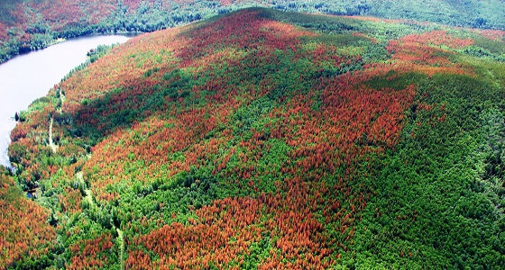

# Introduction {#sec-introduction}

The mountain pine beetle (MPB), Dendroctonus ponderosae, is a native wood-boring insect to pine forests in Western North America. The MPB attacks a wide range of pine trees and their population periodically erupts causing large-scale outbreaks. In the late 1990s, the most recent outbreak of MPB in British Columbia began and resulted in the death of more than 18 million ha of pine forests by the year 2011 [@bleiker2019]. The scale and level of tree mortality associated with this outbreak was attributed to the continuous geographic and host range expansion of the mountain pine beetle into previously undisturbed forests [@bleiker2019; @cooke2017; @hicke2006]. In addition to this outbreak, concern for the potential MPB range expansion into the boreal and eastern pine forests grew, as the MPB had spread from its preferred lodgepole pine (Pinus Contorta) host and began successfully attacking and reproducing in jack pine (Pinus Banksiana), a transcontinental pine species [@cooke2017; @cullingham2011]. To control MPB populations and slow the spread of infestation, various mitigation and management strategies are required, this includes sanitation harvesting to remove infested trees, salving logging (clear cut) operations, prescribed burns, and the use of attractants, repellants and insecticides [@coops2008; @fettig2014; @gillette2014; @lindenmayer2012; @six2014].

MPB outbreaks have significant impacts on forest structure and ecosystem services (i.e., timber supply, water supply, scenic beauty, carbon storage) [@dhar2016]. MBP infestation alters overstory forest cover, decreasing canopy cover and creating canopy gaps, which has cascading effects on the understory vegetation, resulting in increased light penetration and reduced snow interception [@chan-mcleod2006; @fornwalt2018; @saab2014]. These ecological changes in pine forests, following MPB outbreaks have important implications and effects on wildlife populations and their habitats [@saab2014]. In particular MPB outbreaks affect Woodland caribou (Rangifer tarandus), which are a designated species-at-risk in Canada [@canada2012] that require large tracts of low-productivity coniferous forests characterized by low densities of other ungulates and wolves in order to sustain healthy populations [@festa-bianchet2011]. The preferred woodland caribou habitat is characterized by mature, open canopy coniferous stands - the selection for these stands is in part related to the stands structure allowing for the facilitation and growth of arboreal and terrestrial lichen mats which are important food sources for caribou to forage during winter months [@cichowski2022; @festa-bianchet2011; @rapai2017; @rudolph2019; @russell2019].

Remote sensing technology is a useful tool that allows for the acquisition of information about the earths surface. Remotely sensed data is available at a variety of spatial and temporal resolutions [@lechner2020]. Research in the field of remote sensing has benefited from the trend of large, data-analysis ready, remotely sensed datasets to be free and open-access for research [@lechner2020]. A notable example being the complete archive from the Landsat series of satellites dating back to 1972, which provides over 50 years of Earth observation data [@white2014a]. Remote sensing has become an essential tool in the fields of forest ecology and management [@kwok2018; @lechner2020]. Applications for remote sensing in forest ecology include updating forest inventories [@shang2020], measuring forest structure [@lim2003] and characterizing forest habitat structure [@guo2017], mapping the presence and distribution of tree species [@fassnacht2016; @hermosilla2022; @thompson2015], monitoring forest health [@lausch2016] and in the detection, mapping and monitoring of insect outbreaks [@wulder2006] among others.

The ecological changes to pine forests following MPB outbreaks impacts the range and abundance of this key woodland caribou habitat. To understand the future risks posed by the MPB to caribou in Canada, and to inform future species-at-risk management strategies, it is imperative to understand the current conditions of key caribou habitat. The primary objective of this research is to develop high spatial resolution, tree species prediction, for key overstory tree species found in MPB-impacted ecosystems across the entire caribou range in western Canada (in Alberta, British Columbia and the Yukon). Key overstory tree species are individual species of pine, spruce and deciduous. The resultant species layers produced will provide fine scale species information for managers and researchers to facilitate trade-offs between species-at-risk management, MPB mitigation efforts and timber extraction.

------------------------------------------------------------------------

